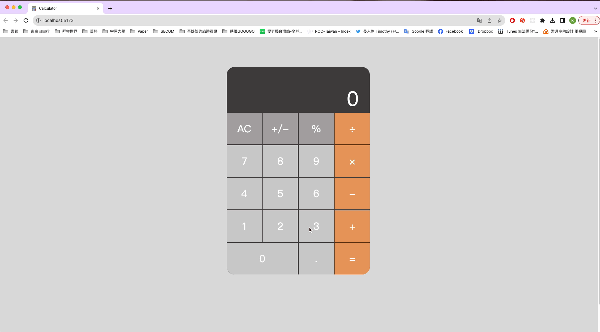

# Calculator Project

This is a calculator project developed using Vite and TypeScript, aimed at practicing Object-Oriented Programming (OOP) concepts. The project serves as a practical example of building a web application from scratch, employing vanilla JavaScript and TypeScript for a strong foundation in object-oriented development. [View Demo](https://qweb321.github.io/Calculator/)

## Table of contents
- [Features](#features)
- [Technologies Used](#technologies-used)
- [Screenshot](#screenshot)
- [Getting Started](#getting-started)
- [Learning OOP](#learning-object-oriented-programming-oop)

## Features
- Basic arithmetic operations (addition, subtraction, multiplication, division).
- Ability to chain multiple calculations together.
- User-friendly interface with a display for input and results.
- Clear button to reset the calculator.

## Technologies Used
- Vite: A fast build tool for modern web development.
- TypeScript: A statically typed superset of JavaScript that enhances code quality.
- HTML and CSS: Standard web technologies for structuring and styling the calculator.

## Screenshot


## Getting Started
To run this project locally, follow these steps:
1. Clone the repository:
```
git clone https://github.com/yourusername/calculator-project.git
```

2. Navigate to the project directory:
```
cd calculator-project
```

3. Install dependencies:
```
npm install
```

4. Start the development server:
```
npm run dev
```
5. Open your browser and visit http://localhost:5173 to see the calculator in action.


## Learning Object-Oriented Programming (OOP)
This project is designed for developers looking to enhance their understanding of OOP in TypeScript. Key OOP principles, such as encapsulation and abstraction, are implemented within the Calculator class.

- Calculator class encapsulates the calculator's state and functionality.
- Methods within the class are defined for clearing, appending numbers, and computing results.
- The class demonstrates the power of TypeScript in creating well-structured, maintainable code.


## Contributors
- Isis Lin - Developer